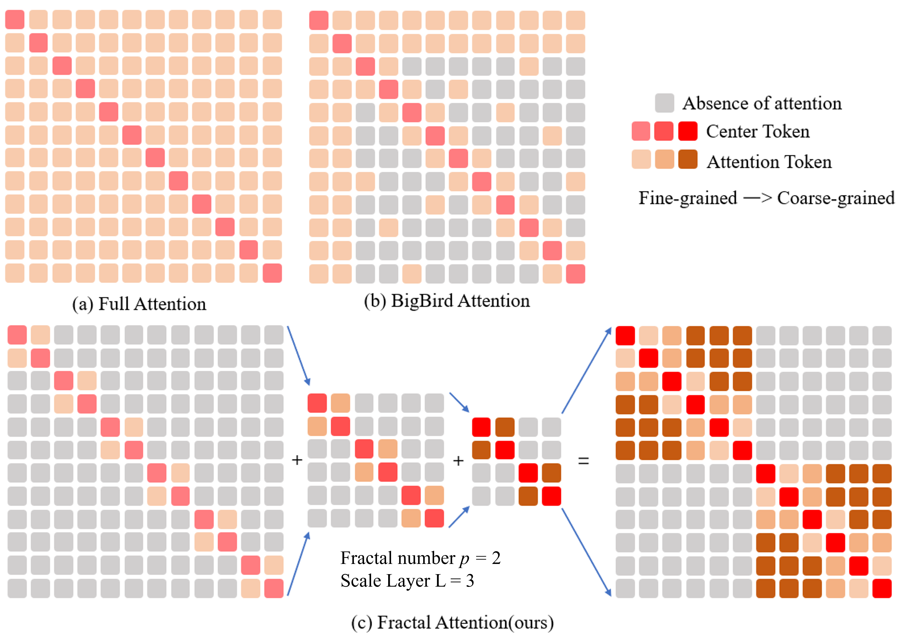
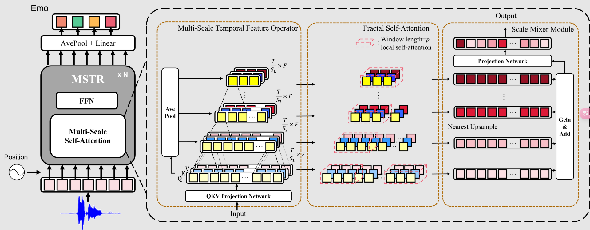

# Transformer Thời gian Đa tỷ lệ cho Nhận diện Cảm xúc qua Giọng nói
# Tóm tắt
Nhận diện cảm xúc qua giọng nói đóng vai trò quan trọng trong các hệ thống tương tác người-máy. Gần đây, nhiều mô hình Transformer tối ưu hóa đã được áp dụng thành công cho nhận diện cảm xúc qua giọng nói. Tuy nhiên, các kiến trúc Transformer hiện tại tập trung nhiều vào thông tin toàn cục và đòi hỏi lượng tính toán lớn. Mặt khác, các biểu diễn cảm xúc trong giọng nói tồn tại cục bộ ở nhiều phần khác nhau của đoạn giọng nói đầu vào. Để giải quyết những vấn đề này, chúng tôi đề xuất một Transformer Đa tỷ lệ (MSTR) cho nhận diện cảm xúc qua giọng nói. Mô hình bao gồm ba thành phần chính: (1) một toán tử đặc trưng thời gian đa tỷ lệ, (2) một mô-đun tự chú ý phân dạng (fractal self-attention), và (3) một mô-đun trộn tỷ lệ (scale mixer). Ba thành phần này có thể nâng cao hiệu quả khả năng học các biểu diễn cảm xúc cục bộ đa tỷ lệ của Transformer. Kết quả thử nghiệm cho thấy mô hình MSTR đề xuất vượt trội đáng kể so với Transformer cơ bản và các phương pháp tiên tiến khác trên ba tập dữ liệu cảm xúc giọng nói: IEMOCAP, MELD và CREMA-D. Ngoài ra, mô hình này giảm đáng kể chi phí tính toán.
# 1. Giới thiệu
Trong những năm gần đây, với sự phát triển của trí tuệ nhân tạo và robot, tính toán cảm xúc (affective computing) ngày càng trở nên quan trọng trong các hệ thống tương tác người-máy. Cảm xúc và ý định của con người được thể hiện rõ rệt trong giọng nói. Nhận diện cảm xúc qua giọng nói (speech emotion recognition - SER) có nhiều ứng dụng thực tiễn trong các hệ thống hội thoại giọng nói, phân tích cuộc gọi tại trung tâm chăm sóc khách hàng, và nhiều lĩnh vực khác. SER cũng có tiềm năng được ứng dụng trong các thiết bị thông minh. Mặc dù đã có nhiều tiến bộ trong xử lý giọng nói, việc hiểu cảm xúc tự nhiên vẫn là một thách thức lớn đối với nhiều hệ thống thông minh.

Với sự tiến bộ của mạng nơ-ron sâu, nhiều nỗ lực đã được thực hiện để phân loại các câu nói mang cảm xúc thông qua mạng nơ-ron hồi tiếp (RNN) và mạng nơ-ron tích chập (CNN). Guo và cộng sự [1] đã đề xuất một mô hình CNN dựa trên mô-đun chú ý phổ-thời gian-kênh (spectro-temporal-channel attention) để cải thiện khả năng học biểu diễn cảm xúc. Một số thuật toán [2, 3, 4] sử dụng RNN để mô hình hóa chuỗi thời gian và cơ chế chú ý để cân chỉnh các token thời gian, qua đó hỗ trợ việc trích xuất biểu diễn cảm xúc từ giọng nói.

Các Transformer dựa trên cơ chế tự chú ý (self-attention) [5, 6, 7, 8] đã trở thành nền tảng chính trong xử lý ngôn ngữ tự nhiên (NLP) và thị giác máy tính (Computer Vision). Lấy cảm hứng từ thành công trong NLP, các nhà nghiên cứu đã thử thay thế hoàn toàn CNN hoặc RNN bằng Transformer. Những tiến bộ đáng kể đã được ghi nhận trong nhiều nhiệm vụ liên quan đến giọng nói, chẳng hạn như nhận diện giọng nói tự động [9, 10, 11] và cải thiện chất lượng giọng nói [12, 13, 14]. Tuy nhiên, tài nguyên tính toán cần thiết cho Transformer với cơ chế chú ý đầy đủ (full-attention) tăng theo hàm bậc hai với độ dài chuỗi, khiến việc triển khai trên các thiết bị di động và nhúng trở nên khó khăn. Ngoài ra, ứng dụng của Transformer trong nhận diện cảm xúc qua giọng nói (SER) vẫn còn hạn chế, vì cảm xúc con người vốn phức tạp và mơ hồ. Một số tác giả đã đề xuất các cơ chế chú ý thưa (sparse attention) dựa trên Transformer, như BigBird [15] trong NLP, Image Transformer [16], và Swin Transformer [17] trong CV, nhưng các phương pháp này không phù hợp hoàn toàn với nhiệm vụ SER, bởi cảm xúc thường được thể hiện trong các đoạn giọng nói dài và liên tục. Do đó, cần thiết phải thiết kế các Transformer chuyên biệt cho SER. Chen và cộng sự [18] đã đề xuất một thuật toán dựa trên Transformer để thu nhận tất cả đặc trưng cảm xúc thông qua một bộ trích xuất đặc trưng có kích thước cố định. Cách tiếp cận này có thể không phù hợp, vì cảm xúc con người có thể được thể hiện ở các phần khác nhau của giọng nói với các khoảng thời gian khác nhau. Zhu và cộng sự [19] đã sử dụng hai kích thước nhân tích chập khác nhau để mô phỏng việc trích xuất cảm xúc đa tỷ lệ từ giọng nói. Chúng tôi tin rằng việc sử dụng thông tin tỷ lệ thời gian đa dạng hơn sẽ hữu ích hơn cho việc trích xuất cảm xúc. Các tín hiệu cảm xúc mang tính chất đa hạt (multi-grained), do đó một Transformer hiệu quả và nhẹ, có thể tận dụng các đặc trưng âm thanh ở nhiều mức độ hạt khác nhau, sẽ phù hợp hơn cho nhiệm vụ nhận diện cảm xúc qua giọng nói (SER). 

Hình 1:So với các cơ chế chú ý khác nhau. Chú ý đầy đủ có nghĩa là chi phí tính toán cao và sự dư thừa chú ý không cần thiết và sự chú ý thưa thớt khác không tính đến các đặc điểm của cảm xúc trong lời nói. Chúng tôi đề xuất trích xuất biểu diễn cảm xúc trong các thang thời gian lời nói khác nhau.

Để giải quyết các hạn chế của các Transformer hiện tại trong SER, chúng tôi đề xuất một Transformer Đa tỷ lệ (MSTR).

Hình 2: Kiến trúc tổng thể của Transformer Đa tỷ lệ (MSTR) được đề xuất cho nhận diện cảm xúc qua giọng nói. Mỗi khối cơ bản của MSTR chủ yếu bao gồm ba thành phần chính: một toán tử thời gian đa tỷ lệ, một mô-đun tự chú ý phân dạng, và một mô-đun trộn tỷ lệ. FFN là viết tắt của mạng truyền thẳng (feedforward networks).
Các đóng góp của bài báo này được tóm tắt như sau:

- Để thu nhận các biểu diễn cảm xúc giọng nói đa hạt, chúng tôi đề xuất MSTR, mô hình dựa trên Transformer hiệu quả đầu tiên khai thác các đặc trưng thời gian đa tỷ lệ. Các thí nghiệm cho thấy tiềm năng lớn của phương pháp được đề xuất trong việc mô hình hóa cảm xúc con người được thể hiện ở các mức độ hạt thời gian khác nhau trong giọng nói.

- Các thí nghiệm cũng cho thấy mô hình được đề xuất đạt được kết quả tương đương với các phương pháp tiên tiến khác trên các tập dữ liệu chuẩn SER là IEMOCAP [20], MELD [21] và CREMA-D [22], nhưng với yêu cầu tính toán thấp hơn đáng kể.
# 2. Phương pháp
Kiến trúc tổng thể của mô hình MSTR được đề xuất được thể hiện trong Hình 2. Như có thể thấy, khác với Transformer cơ bản (vanilla Transformer), khối cơ bản của mạng MSTR được đề xuất chủ yếu bao gồm ba thành phần: một toán tử đặc trưng thời gian đa tỷ lệ, một mô-đun tự chú ý phân dạng, và một mô-đun trộn tỷ lệ. Toán tử đặc trưng thời gian đa tỷ lệ nhận đặc trưng âm thanh thô hoặc đầu ra từ tầng thấp hơn làm đầu vào và tạo ra nhiều đặc trưng đầu ra với các tỷ lệ thời gian khác nhau. Mô-đun tự chú ý phân dạng được sử dụng để mô hình hóa hiệu quả các quan hệ thời gian giữa các khung (frames) khác nhau trong một cửa sổ có độ dài cố định. Cuối cùng, mô-đun trộn tỷ lệ kết hợp hiệu quả các đặc trưng ở các tỷ lệ thời gian khác nhau để tạo ra một biểu diễn cảm xúc thống nhất và tổng hợp. So với cơ chế chú ý đầy đủ (full attention) ban đầu, chú ý phân dạng hiệu quả hơn trong việc học các đặc trưng đa hạt, đồng thời giảm đáng kể sự dư thừa của mô hình. Các mô-đun khác như mạng truyền thẳng (feedforward network) vẫn giữ nguyên như trong Transformer cơ bản. Đầu ra của Transformer sẽ được đưa vào một bộ phân loại với ba tầng kết nối đầy đủ (fully connected layers) để phân loại cảm xúc. Chi tiết về các thành phần này được trình bày trong các phần tiếp theo.
# 2.1 Toán tử Đặc trưng Thời gian Đa tỷ lệ
Chúng tôi đề xuất một toán tử đặc trưng thời gian đa tỷ lệ để trích xuất song song các biểu diễn đặc trưng đa tỷ lệ từ các đặc trưng âm thanh thô hoặc đầu ra từ tầng thấp hơn. Toán tử này nhận một tập đặc trưng tuần tự $X \in \mathbb{R}^{T \times F}$ làm đầu vào, trong đó $T$ là số lượng khung (frames) đầu vào và $F$ biểu thị chiều của đặc trưng. Tương tự như Transformer cơ bản, chúng tôi trước tiên thu nhận Query, Key và Value. Cụ thể, đầu vào $X$ được chiếu vào $Q = XW^{Q}$, $K = XW^{K}$, và $V = XW^{V}$, trong đó $W^{Q}, W^{K}, W^{V} \in \mathbb{R}^{F \times F}$.

## Giải thích từng phần:
$X \in R^{T\times X}$
$\rightarrow$ Ma trận đặc trưng đầu vào:
- T: số frame thời gian (kiểu như mỗi lát cắt nhỏ của sóng âm).
- F: số chiều đặc trưng tại mỗi frame (kiểu như MFCC, Wav2Vec features, hoặc embedding từ mạng trước đó). 

### Chiếu vào Q, K, V:
- Để mô hình học được mối quan hệ giữa các frame, ta phải chuyển đổi đầu vào thành Query, Key, Value.

$$Q=XW^Q,K=XW^K,V=XW^V$$

### Ở đây:
-   $W^Q, W^K, W^V \in \mathbb{R}^{F \times F}$ là các ma trận trọng số học được.
- Các phép nhân này đơn giản là chiếu không gian đặc trưng đầu vào sang 3 không gian mới: không gian của Query, Key và Value.

### Hình dung:
- Giả sử mỗi frame là một vecotr 512 chiều $\rightarrow F=512$
- Tổng cộng có 100 frames $\rightarrow T=100$
- khi đó ${X}$ là ma trận $100 \times 512$
- Sau khi nhân với $W^Q \in \mathbb{R}^{512 \times 512}$ → thu được $Q \in \mathbb{R}^{100 \times 512}$
### Ý nghĩa:
- Query (Q): Thứ dùng để hỏi – muốn biết cái gì?

- Key (K): Thứ để tra – kiểu như nội dung dữ liệu đang có.

- Value (V): Thứ để lấy ra – thông tin cần giữ lại.
$\rightarrow$ Kết hợp Q-K-V để học mối quan hệ giữa các thời điểm khác nhau trong chuỗi âm thanh.
### Tại sao cần Q,K,V:
- Đây là để tính attention scores:
$$Attention(Q,K,V)=softmax({QK}/\sqrt{{d}_{k}})V$$

Như được thể hiện trong Hình 2, tập { ${Q},{K},{V}$ }  thu được sau đó được đưa vào một mô-đun gộp trung bình (average pooling) riêng biệt để thu nhận các đặc trưng ở các tỷ lệ thời gian khác nhau. Cụ thể, một hệ số tỷ lệ $S_k = p^{k-1}$ được thiết kế cho mức tỷ lệ thứ $k$, trong đó $p$ là hệ số phân dạng (fractal factor) và $K \in$ {1, 2, ..., L}. Mức tỷ lệ thứ $k$ hoạt động dựa trên mức tỷ lệ thứ $k-1$ bằng cách lấy trung bình $p$ khung liền kề. Nói cách khác, tập đặc trưng đầu vào { ${Q}, {K}, {V}$ } đi qua toán tử gộp trung bình để thu nhận các tập đặc trưng tỷ lệ thời gian ở các tỷ lệ thời gian khác nhau ${X}^{K} = \{Q^K,K^K,V^K\} \in R^{{T/S^K} \times F}$ . Tập đặc trưng mới $\textbf{X}^{k}$ sẽ được đưa vào mô-đun tự chú ý phân dạng để mô hình hóa mối quan hệ thời gian của các đặc trưng. Đáng chú ý là việc sử dụng toán tử gộp thay vì tích chập (convolution) có thể hoạt động tốt hơn, duy trì cấu trúc thời gian ban đầu, và không thêm bất kỳ tham số bổ sung nào.

# Giải thích từng phần
## Phân tích công thức
1. Tập $\{Q,K,V\}$ 
Ba thứ này đến từ cơ chế self-attention – là những đại diện toán học cực mạnh giúp mô hình hiểu quan hệ giữa các khung thời gian.
2. Toán tử gộp trung bình (Average pooling)
> Cụ thể một hệ số tỷ lệ

$S_k = p^{k-1}$
được thiết kế cho tỷ lệ thứ $k$ 
- $S_k$: tỷ lệ scale Tỷ lệ càng lơn thì gộp càng nhiều khung thời gian lại với nhau $\rightarrow$ nhìn dữ liệu ở cấp độ vĩ mô
- $p$: hệ số phân dạng - tức là mỗi lần tăng scale, thời gian quan sát sẽ mở rộng theo lũy thừa của $p$.
- ví dụ:Nếu $p=2$ thì:
- - $S_1 = 2^{0} = 1$ → không thay đổi gì.

- - $S_2 = 2^{1} = 2$ → gộp 2 khung liên tiếp lại thành 1.

- - $S_3 = 2^2 = 4$ → gộp 4 khung liên tiếp lại. 
3. Cách gộp
> Mức tỷ lệ thứ $k$ hoạt động dựa trên mức $k-1$ bằng cách lấy trung bình $p$ khung liền kề.

Cứ mỗi lần nâng scale, là mình nhìn thời gian rộng hơn, giống như chuyển từ xem frame-by-frame $\rightarrow$ từng đoạn ngắn $\rightarrow$ cả một chuỗi dài.

4. Tạo đặc trung đa tỷ lệ thời gian
Sau khi gộp xong: 
$${X}^k = {Q^k,K^k,V^k} \in R^{T/S^k\times f}$$
- $T$: tổng số khung thời gian ban đầu.

- $S^K$: tỷ lệ thời gian ở cấp độ thứ K.

- $F$: số lượng đặc trưng tại mỗi khung (feature dimension).
Nói cách khác, sau khi gộp, số lượng frame giảm còn $T/S^K$, nhưng mỗi frame giờ mang ý nghĩa rộng hơn về mặt thời gian. Và mình vẫn giữ được kích thước đặc trưng là $F$.

5. Đưa vào self-attention
> Tập đặc trưng mới $\textbf{X}^{k}$ được đưa vào mô-đun tự chú ý phân dạng.

Cái này chính là một phiên bản attention theo từng tầng fractal, giúp mô hình hiểu:
- Quan hệ ngắn hạn ở mức nhỏ,

- Quan hệ dài hạn ở mức scale lớn.

6. Tại sao không dùng convolution?
> Việc sử dụng toán tử gộp thay vì tích chập (convolution) giúp:

- Giữ được cấu trúc thời gian gốc (convolution có thể làm méo mó dữ liệu).

- Không cần tham số → nhẹ hơn, nhanh hơn, ít overfitting.

